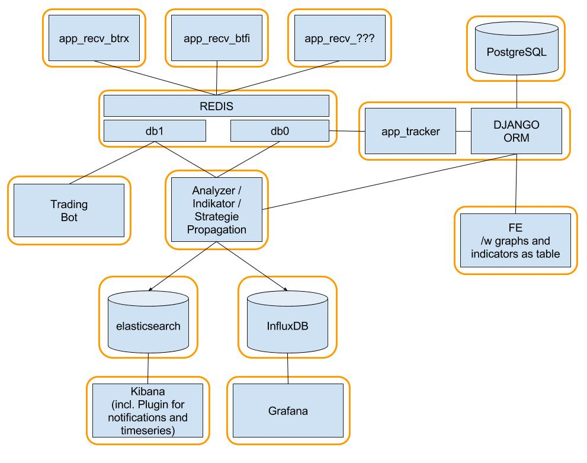

# YaMSv2
Yet another MarketScanner v2

YaMS v2 is intended to pull data from exchanges (every 5m, 30m, 4h, 1d), adding indicators to the stream and saving it to an elastisearch instance where you can further investigate your strategies with Kibana.
 


# Features
- Supported Exchanges:
  - Bittrex (via REST-Api)
- create your own strategy and indicator as a plugin

# Requirements
- docker

# Usage
* build and run
```
cp sample.config.yml config.yml
docker-compose down && docker-compose build && docker-compose up
```

* cleanup
```
docker run --rm -ti yamsv2_app_tracker /bin/bash
docker-compose down && rm -rf data/
for i in $(docker ps -a -q); do docker rm -f "${i}"; done
for i in $(docker images -a -q); do docker rmi "${i}"; done
```

* Forwarding rules:
```
ssh yams -L 8080:0.0.0.0:80 -L 8083:0.0.0.0:8083 -L 8086:0.0.0.0:8086
```

* Grafana queries
```
SHOW MEASUREMENTS
SHOW FIELD KEYS FROM "all"
```

# Contributing
Feel like there is a feature missing? I welcome your pull requests! Few pointers for contributions:

- Create your PR against the `master` branch
- If you are unsure, discuss the feature on the [btc-echo slack](https://btc-echo.slack.com/) in room `#tools` or in a [github issue](https://github.com/YaMSorg/yams/issues) before

# Donations
Feel like you wanna honor my work? That's awesome!
Just ask me in the Chat for a donation address :)

# Links
* https://stackoverflow.com/questions/45595750/use-django-orm-outside-of-django
* https://stackoverflow.com/questions/41825037/how-to-execute-external-script-in-the-django-environment/41826771#41826771
* https://stackoverflow.com/questions/33170016/how-to-use-django-1-8-5-orm-without-creating-a-django-project
* https://vincent.is/speeding-up-django-postgres/

# TODO
- redis to own image:
```
redis_1          | 1:C 05 Nov 19:27:45.425 # oO0OoO0OoO0Oo Redis is starting oO0OoO0OoO0Oo
redis_1          | 1:C 05 Nov 19:27:45.426 # Redis version=4.0.2, bits=64, commit=00000000, modified=0, pid=1, just started
redis_1          | 1:C 05 Nov 19:27:45.426 # Warning: no config file specified, using the default config. In order to specify a config file use redis-server /path/to/redis.conf
redis_1          | 1:M 05 Nov 19:27:45.426 * Running mode=standalone, port=6379.
redis_1          | 1:M 05 Nov 19:27:45.427 # WARNING: The TCP backlog setting of 511 cannot be enforced because /proc/sys/net/core/somaxconn is set to the lower value of 128.
redis_1          | 1:M 05 Nov 19:27:45.427 # Server initialized
redis_1          | 1:M 05 Nov 19:27:45.428 # WARNING you have Transparent Huge Pages (THP) support enabled in your kernel. This will create latency and memory usage issues with Redis. To fix this issue run the command 'echo never > /sys/kernel/mm/transparent_hugepage/enabled' as root, and add it to your /etc/rc.local in order to retain the setting after a reboot. Redis must be restarted after THP is disabled.
redis_1          | 1:M 05 Nov 19:27:45.429 * DB loaded from disk: 0.001 seconds
redis_1          | 1:M 05 Nov 19:27:45.429 * Ready to accept connections
```
- db image: send message to redis, when db is finally loaded
- monitoring!
- keep-alive thread which sends out a str+nonce to controller and back 
  - use different strigns for db ready and keepalive(ping-pong) of controller or getter
- use extra redis channel for "which data should be received next"-queue, for the getter as well as when controller detects len(data)==0  


# Queries
```
SELECT "close" FROM "btrx-BTC-1ST-5m" WHERE "tval" > now() - 30m
SELECT DIFFERENCE("close") FROM "btrx-BTC-1ST-5m" WHERE "tval" > now() - 30m

```

